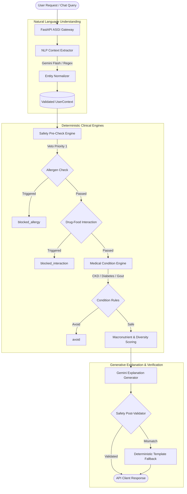

# NutriGuard Architecture & Engineering Specification

## 1. System Overview & Core Principles

NutriGuard is architected to solve a critical limitation of generic diet apps: **the risk of LLM hallucinations in clinical and nutritional decision-making**.

In NutriGuard, nutritional calculations, pharmacological safety, and medical contraindications are governed by **100% deterministic engines**, while generative AI (Google Gemini 1.5/2.0 Flash) is strictly deployed as an interface layer for natural language understanding and educational synthesis.

### Guiding Architectural Principles

1. **Deterministic Safety Supremacy**: Generative models can never override or loosen a safety veto, allergen block, or drug-food contraindication.
2. **Indian Kitchen Calibration**: Food intake is modeled using realistic Indian household measurements (rotis, katoris, glasses, plates) based on the ICMR-NIN Indian Food Composition Tables (IFCT 2017).
3. **Graceful Degradation**: If external LLM APIs are unreachable or unconfigured, the platform executes rule-based keyword fallbacks with zero clinical degradation.
4. **Auditability & Traceability**: Every food evaluation produces an auditable trace containing triggered rule IDs, clinical rationales, and dataset citations.

---

## 2. Hybrid AI Architecture



### Safety Veto Hierarchy

Deterministic classification follows strict precedence rules:

| Priority | Check Type | Outcome If Triggered | Overridable by AI? |
|---|---|---|---|
| **1 (Highest)** | Food Allergen Match (Primary / Cross-reactive) | `blocked_allergy` | **Never** |
| **2** | Pharmacological Drug-Nutrient Interaction | `blocked_interaction` | **Never** |
| **3** | Medical Condition Absolute Contraindication | `avoid` | **Never** |
| **4** | Quantitative Nutrient Threshold (GI, Purines) | `caution` / `moderate` | **Never** |
| **5 (Lowest)** | Calorie, Macro, & Regional Preference Scoring | `recommend` (Score 0-100) | Influenced by diversity |

---

## 3. Compositional Indian Food & Recipe Engine

### Household Measurement Modeling

In Indian cooking, recipes are not prepared in generic imperial units. NutriGuard models portions hierarchically:

- **1 Katori**: 150g - 180g (Cooked Dal, Sabzi, Raita, Kheer)
- **1 Roti / Phulka**: 30g - 40g whole wheat dough (~80-90 kcal)
- **1 Paratha**: 60g - 80g dough with ghee/oil (~220-250 kcal)
- **1 Glass**: 240ml (Chaas, Lassi, Turmeric Milk)
- **1 Plate**: Standard thali or rice portion (200g - 250g)

### Compositional Rollup Formula

For any meal $M$ composed of raw ingredients $I_1, I_2, \dots, I_k$ with raw quantities $q_i$ and nutrient densities $N_{i, \text{nutrient}}$:

$$\text{MealNutrient}(M) = \sum_{i=1}^k \left( \frac{q_i}{100} \times N_{i, \text{nutrient}} \right) \times \text{RetentionFactor}(\text{method}_i, \text{nutrient})$$

Where $\text{RetentionFactor}$ accounts for nutrient retention through boiling, pressure cooking, or tadka frying based on ICMR-NIN cooking guidelines.

---

## 4. Energy & Macro Requirements (Mifflin-St Jeor & ICMR RDA)

### Basal Metabolic Rate (BMR)

$$\text{BMR}_{\text{male}} = 10 \times \text{weight (kg)} + 6.25 \times \text{height (cm)} - 5 \times \text{age (yr)} + 5$$

$$\text{BMR}_{\text{female}} = 10 \times \text{weight (kg)} + 6.25 \times \text{height (cm)} - 5 \times \text{age (yr)} - 161$$

### Total Daily Energy Expenditure (TDEE)

$$\text{TDEE} = \text{BMR} \times \text{ActivityMultiplier}$$

- Sedentary: 1.2
- Lightly Active: 1.375
- Moderately Active: 1.55
- Very Active: 1.725

Macro targets are balanced according to the **ICMR-NIN Dietary Guidelines for Indians (2024)**:
- **Carbohydrates**: 50% - 60% of total energy
- **Proteins**: 0.8g - 1.2g per kg reference body weight
- **Fats**: 20% - 25% (incorporating healthy MUFA/PUFA from mustard, sesame, and groundnut oils)

---

## 5. Clinical Safety Rules Matrix

| Medical Condition / Drug | Nutrient Target | Deterministic Rule Mechanism |
|---|---|---|
| **Warfarin (Coumadin)** | Vitamin K ($\le 50\,\mu\text{g}$) | Blocks or flags green leafy vegetables (Palak, Methi, Mustard greens) to prevent prothrombin time destabilization. |
| **Metformin** | Vitamin B12 | Identifies long-term Metformin usage and enforces B12-rich foods or supplementation warnings. |
| **Chronic Kidney Disease (Stage 4+)** | Potassium ($\le 2000\,\text{mg}$), Sodium ($\le 1500\,\text{mg}$), Protein ($\le 0.8\,\text{g/kg}$) | Vetoes high-potassium fruits (banana, coconut water) and high-sodium pickles/papads; regulates dal quantities. |
| **Type 2 Diabetes** | Glycemic Index ($< 55$), Dietary Fiber | Favors high-fiber legumes (Moong, Chana, Rajma) and millets (Jowar, Bajra, Ragi) over refined wheat and white rice. |
| **Gout / Hyperuricemia** | Purines | Restricts high-purine lentils, brewer's yeast, and organ meats to avoid acute uric acid crystallization. |
| **Hypertension** | Sodium ($\le 1500\,\text{mg}$) | Blocks processed canned foods, namkeens, and papads with excess salt. |
| **GERD / Acid Reflux** | Spices, Citrus, High Fat | Flags heavily spiced fried items (Samosas, Mirchi Bajji) and recommends cooling dishes (Cucumber Raita, Buttermilk). |

---

## 6. Relational Database Schema & Migration Linearity

The database schema is managed via **Alembic** in a strictly linear migration chain:

```
[1efabd3beb36] Initial baseline schema
       │
       ▼
[f18e00b797e8] Core nutrition & food tables
       │
       ▼
[98c4cadc5255] Diversity engine & daily meal plans
       │
       ▼
[ec1dd30679ea] Clinical review rules & audit tables
       │
       ▼
[a7b2c3d4e5f6] Harmonized meal_plans & foods clinical columns (HEAD)
```

### Core Schema Models

```
┌──────────────────┐       ┌───────────────────────┐       ┌─────────────────────┐
│      users       │1     *│       profiles        │1     *│    allergies        │
├──────────────────┤◄──────├───────────────────────┤──────►├─────────────────────┤
│ user_id (UUID)   │       │ profile_id (UUID)     │       │ allergen_id (UUID)  │
│ email (string)   │       │ age, sex, weight, ht  │       │ name, aliases       │
│ role (string)    │       │ dietary_pattern       │       └─────────────────────┘
└────────┬─────────┘       │ regional_preference   │
         │1                └───────────────────────┘
         │*
┌────────┴─────────┐       ┌───────────────────────┐       ┌─────────────────────┐
│    meal_plans    │1     *│      foods            │1     *│   food_nutrition    │
├──────────────────┤◄──────├───────────────────────┤◄──────├─────────────────────┤
│ plan_id (UUID)   │       │ food_id (UUID)        │       │ amount, unit        │
│ plan_date (date) │       │ name, aliases         │       │ per_quantity (100g) │
│ total_calories   │       │ category, subcategory │       └──────────┬──────────┘
│ health_score     │       │ glycemic_index        │                  │*
└──────────────────┘       │ purine_level          │                  ▼1
                           │ vitamin_k_mcg         │       ┌─────────────────────┐
                           │ nutrient_source       │       │     nutrients       │
                           └───────────────────────┘       ├─────────────────────┤
                                                           │ nutrient_id (UUID)  │
                                                           │ name, unit, category│
                                                           └─────────────────────┘
```

---

## 7. Security & Privacy Controls

- **Cryptographic Security**: Passwords hashed with passlib/bcrypt; tokens signed with HMAC-SHA256 (`HS256`).
- **Authorization Scopes**: Role-based access control (`USER`, `CLINICAL_REVIEWER`, `ADMIN`).
- **CORS Protection**: Configurable allowed origins preventing CSRF and unauthorized cross-origin requests.
- **Render DB Rewrites**: Automatic translation of incoming `postgres://` URLs to SQLAlchemy-compliant `postgresql://`.
- **Zero Secret Leakage**: No production API keys, passwords, or credentials stored in repository code; all retrieved via environment variables.
